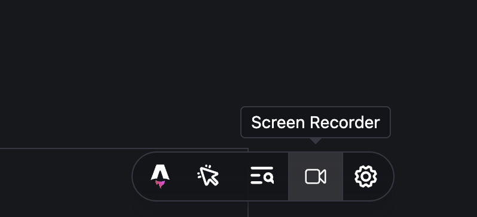
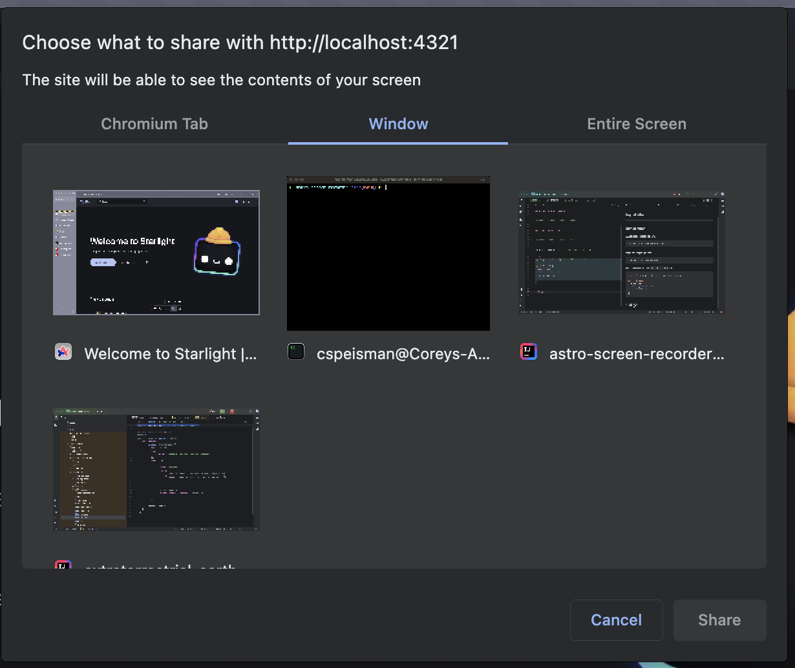

### Astro Screen Recorder

Astro Screen Recorder is a dev toolbar integration that lets you capture and record your computer's screen, a specific window, or browser tab. It's very useful for if you're putting together a documentation site in Astro and need to quickly capture a feature walk through. 

## Installation

---
## Installation

### Automatic installation:

```
npx astro add astro-screen-recorder
```

### Manual installation:

```
npm install astro-screen-recorder
```

Add the following to your `astro.config.mjs` file:

```js
import screenRecorder from "astro-screen-recorder";

export default {
  integrations: [
    // other integrations
    screenRecorder(),
  ],
};
```

## Usage
Astro Screen Recorder will show up as a new icon in the dev toolbar




You can then select what screen, application, or tab to share



